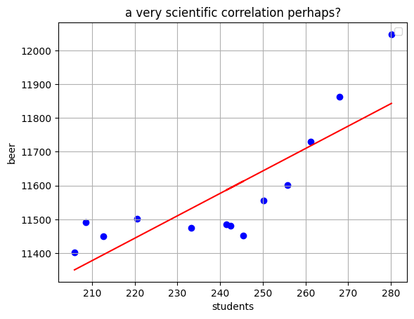

# Assignment

Student name: Tijn van Batenburg
Student ID: 17036186

- "The Rise of Coccidioides: Forces Against the Dust Devil Unleashed"
- "An analysis of the forces required to drag sheep over various surfaces"
- "Correlation of continuous cardiac output measured by a pulmonary artery catheter versus impedance cardiography in ventilated patients"

<figure>
  
</figure>

There seems to be a correlation between the total dutch beer consumption and the amount of students in higher education, but no actual conclusion can be drawn. Student population forms a small fraction of total drinkers in the Netherlands and is unlikely to be so impactful on the total liters of beer consumed.

